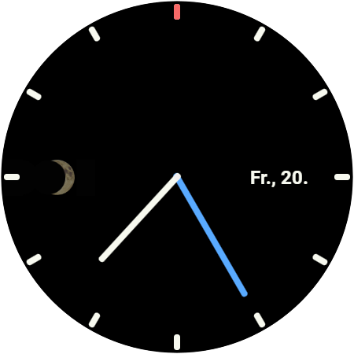

<p align="center">
  
</p>

# workFLOw 01

Analog watchface for Wear OS with moon phases and customizable hand colors.

<p align="center">
  
</p>

## Beta Testing

We're looking for testers to help improve workFLOw 01! Join the closed beta — just a Google account, no watch needed:

[Become a tester on Google Play](https://play.google.com/apps/testing/com.watchfacestudio.workFLOw)

## Features

- **Analog clock** with hour, minute, and second hands
- **Moon phase display** with 8 phases and corona effect at new moon
- **Day & weekday** display (German locale, opens calendar on tap)
- **2 complication slots** (top & bottom) for widgets like step count, sunrise/sunset, etc.
- **Always-on display** with simplified hands

## Customization

All settings are accessible via the watchface editor on the watch or phone.

### Position: Moon Phase & Date
Both elements can be placed at any of 4 positions or turned off:
- **Links** (left) — default for moon
- **Rechts** (right) — default for date
- **Oben** (top)
- **Unten** (bottom)
- **Aus** (off)

### Hand Colors
The three hand colors (warm white, blue, red) can be freely assigned:

| Hand | Default | Options |
|------|---------|---------|
| Hour hand | Warm white `#f7f9ef` | Warm white, Blue, Red |
| Minute hand | Blue `#46a9ff` | Warm white, Blue, Red |
| Second hand | Red `#ff6a6a` | Warm white, Blue, Red |

Colors also apply to the always-on display hands.

## Moon Phases

The moon uses a procedural overlay system (no PNG masks):

| Phase | Type | Display |
|-------|------|---------|
| 0 | New Moon | Dark with 2px corona glow |
| 1 | Waxing Crescent | Thin bright sliver on right |
| 2 | First Quarter | Right half bright |
| 3 | Waxing Gibbous | Mostly bright, thin dark edge left |
| 4 | Full Moon | Full bright texture |
| 5 | Waning Gibbous | Mostly bright, thin dark edge right |
| 6 | Last Quarter | Left half bright |
| 7 | Waning Crescent | Thin bright sliver on left |

## Building

### Requirements
- Android SDK Build Tools 34.0.0 (`aapt2`)
- Java JDK (via Android Studio)
- Signing keystore

### Build
```bash
python build.py
```

Output: `out/com.watchfacestudio.workFLOw.aab`

### Install for testing
```bash
# Build APK from AAB with bundletool, or install AAB via Play Console
adb install out/com.watchfacestudio.workFLOw.apk
```

## Project Structure

```
src/
  AndroidManifest.xml          # App manifest (version, SDK, package)
  raw/watchface.xml            # Main watchface definition (WFF v2)
  xml/                         # Wear OS config XMLs
  drawable-nodpi-v4/           # PNG assets (moon texture, previews)
  values/strings.xml           # English strings (default)
  values-de/strings.xml        # German strings
assets/
  icon.png / icon@2x.png       # App icon (256 / 512px)
  logo.png / logo@2x.png       # Logo (256 / 512px)
  screenshots/                 # Watchface screenshots
docs/
  privacy-policy.html          # Privacy policy (GitHub Pages)
build.py                       # Build script
```

## Technical Details

- **Watch Face Format**: Version 2
- **Min SDK**: 34 (Wear OS 5 / Android 14)
- **Package**: `com.watchfacestudio.workFLOw`
- **Canvas**: 450x450px, circular
- **Clock type**: Analog

## Privacy

This watchface collects no personal data. See [Privacy Policy](https://workflow42.github.io/workFLOw01/privacy-policy.html).

## License

All rights reserved.
